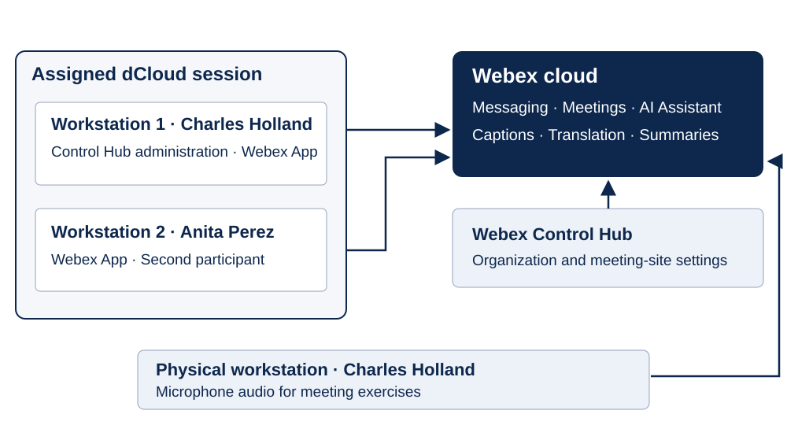

# AI by Design for Collaboration

Session ID: LABCOL-1709

Speakers: Hussain Ali and Omer Ilyas

Technical Marketing Engineers

Cisco Live Melbourne | November 9–12, 2026

## Learning Objectives

Upon completion of this lab, you will be able to:

- Enable Cisco AI Assistant and AI features in Webex Control Hub.
- Use AI Assistant to answer questions and summarize Webex messaging spaces.
- Rewrite messages and translate individual messages or live conversations.
- Schedule a Webex meeting with a natural-language request.
- Test spoken-language detection, closed captions, and translated captions.
- Use meeting AI Assistant for questions, action items, recording summaries, and transcripts.

## Scenario

In this hands-on lab, you will unlock the revolutionary potential of Artificial Intelligence (AI) across the Webex Suite (Messaging and Meeting). As AI continues to redefine the modern workplace, this lab is designed to show you how these technologies fundamentally transform collaboration, communication, and customer interactions. You will explore how Webex AI empowers administrators with better oversight, enriches employee productivity through smarter workflows, and delights customers with more personalized experiences.

You will administer an assigned Webex organization as Charles Holland, then collaborate with Anita Perez using two lab workstations. The messaging exercises lead into a meeting where you test language features and AI-generated meeting information.

Use only the credentials and session access details assigned privately to your lab pod. The public guide excludes example credentials and source screenshots.

## Network Diagram

This diagram shows the logical lab environment. Workstation 1 is assigned to Charles Holland for administration and messaging. Workstation 2 is assigned to Anita Perez. For spoken-audio exercises, sign in as Charles on a physical workstation with a microphone. Use the endpoints supplied privately by your assigned session.

## Task 1: Access and Prepare Your Lab

Connect to your assigned dCloud session, open the two workstations, and sign in to Webex and Control Hub.

### Step 1: Connect to Your Assigned dCloud Session

Open the Details tab on your assigned dCloud eXPO session. Use the host, username, and password provided privately for your session to connect with Cisco Secure Client (formerly AnyConnect). Every session has unique access details. Continue after connecting to your assigned pod.

### Step 2: Open the Lab Workstations

Connect to the Remote desktop of Workstation 1. On your session topology click workstation 1 and click Remote Desktop to connect

The user for Workstation 1 in this lab will be Charles Holland (cholland), username and password will be provided in a file on the Desktop of the workstation.

To connect to Workstation 2, follow similar instructions. The user for Workstation 2 will be Anita Perez (aperez).

On Workstation 1’s desktop, open WEBEX_PASSWORD.txt or Session_Info.txt to obtain the credentials for the Webex App and Webex Control Hub.

### Step 3: Sign In to the Webex Apps

Sign in to the Webex App as Charles Holland on Workstation 1 and Anita Perez on Workstation 2. Use the credentials in the files on the respective workstation desktops.

### Step 4: Sign In to Webex Control Hub

Launch Chrome within Workstation 1 and go to https://admin.webex.com. Sign in with your assigned administrator credentials from the desktop file. If the file is missing, obtain the login details privately from your instructor or session details. Complete the administrative lab tasks within Workstation 1.

Now you can proceed with the lab modules.

### Step 5: Verify the Lab Accounts

Confirm that Charles Holland is signed in on Workstation 1, Anita Perez is signed in on Workstation 2, and Control Hub opens for your assigned Webex organization. Keep both workstations available for the following tasks.

## Task 2: Activate Cisco AI Assistant

Enable the organization-level AI features used by the messaging and meetings exercises. Complete these administrative steps in your assigned lab organization.

### Step 1: Open Control Hub

The Webex Control Hub serves as the central command center for Webex AI. As an administrator, you can decide which AI capabilities are enabled, ensuring they align with your organization’s policies while maximizing productivity. In this module, you will learn how to navigate the AI settings to enable the suite-wide features that power the subsequent modules in this lab.

Open new browser tab with workstation 1’s browser and go to URL  https://admin.webex.com.

Sign in to Webex Control Hub with the Charles Holland credentials from the file on Workstation 1’s desktop.

### Step 2: Set the Lab Idle Timeout

Once logged into Control Hub, for security reasons, Collaboration Control Hub signs out every 20 minutes (Idle timeout) by default. For this lab, let’s make the idle time out longer so the Control Hub does not sign you out often during this lab. Go to MANAGEMENT > Organization Settings > Control Hub’s idle timeout. Drop down the option for Control Hub idle timeout and select 12 hours or no timeout. Click Save.

### Step 3: Enable the AI Features

Next, we will turn on AI features including the Cisco AI Assistant for your pod’s Webex tenant. Continuing on  Organization Settings page scroll down to section  Cisco AI Assistant & AI features > click on Customize AI Assistant & AI features.

Ensure all the toggles are turned ON except for AI Assistant Integrations, External sources (General AI Settings),  AI Assistant workflow automations. Click Save at the bottom right.

### Step 4: Verify Your Changes

Confirm that the requested AI settings were saved. AI Assistant Integrations, External sources, and AI Assistant workflow automations should remain off, as specified for this lab.

## Task 3: Enhance Webex Messaging with AI

Use Charles Holland’s Webex App on Workstation 1. Keep Anita Perez’s Webex App on Workstation 2 available for exchanging messages.

### Step 1: Ask Questions About a Messaging Space

The Ask Me Anything (AMA) feature in Webex messaging is part of the Cisco AI Assistant designed to help users quickly find information within their conversation spaces. It allows users to ask questions about recent discussions, content, or context directly within a space. Any questions that are asked and the answers received are only visible to you and are not saved in the space.

NOTE: The Webex App for the user Charles Holland, logged into workstation 1 may already be preloaded with some chat. If not, feel free to do some back-and-forth chat with the user Anita Perez (Webex App logged into workstation 2).

Continuing on workstation 1, bring up Webex app (logged in as Charles Holland)

Go to the app header on top right corner and click the AI Assistant. Then, select a space from your spaces list.

In the Cisco AI Assistant panel, select:

Ask me anything about recent activity—ask AI Assistant questions, to search for, or find out more, about conversations and content discussed in the space.

Answers come with highlighted citation links that you can click, to go directly to the source messages, so you can quickly get to specific content for more information.

Click More, and select Copy, to copy answer content and share elsewhere.

Click Stop generating to cancel an AI Assistant reply.

### Step 2: Generate a Space Summary

When you're busy, or you've been away from the office, catching up with all your spaces can be challenging. AI Assistant can generate space summaries to help you quickly catch up on missed messages and conversations in the space. Stay informed on decisions, key points, and get up to date with the discussion at a glance.

Continuing on workstation 1, Cisco AI Assistant on Webex, click on Summarize and select 1 hour or 1 week.

Your summary will be displayed in the Cisco AI Assistant panel.

### Step 3: Rewrite a Message

Enhance and improve your communication and collaboration with your team, with AI powered message rewrites. AI Assistant analyses your message and provides options to adapt the style, tone, and content quality, to help you communicate more effectively.

Continuing on workstation 1’s  Webex App.  Type any question in chat window and click Rewrite message. Example: I want the call to happen asap

AI Assistant analyzes your message and provides options to fix mistakes, improve spelling and grammar, update format and style, and change the message tone.

It will open the rewrite pop-up window.  Choose any of the available drop-down options to rewrite your message and click Apply to generate a preview.  Use the regenerate control to produce another preview version. To go back and forth between versions, click the left and right arrows.  Finally when you are satisfied with a new version the message, click Update message, or if you wish to use your original message you can discard all changes by clicking Cancel.  For now keep the message generated with AI (with all your desired options) and press Enter to send your updated message.

### Step 4: Translate Messages

Promote more effective communication and break down barriers in your direct or group spaces with our translation feature. Enable your target language in your settings, and translate individual messages, or all messages in your direct or group spaces in real time.

To translate messages in a space from any language to your desired language, select your language in your settings.

Continuing on workstation 1’s Webex App, click on Profile picture (top left corner) on the Webex app and go to Settings.

It will bring up Webex Settings pop-up window.  On the pop-up window select General > Translation language.  Select your preferred language for translation from the drop-down list, and click Save.

Now, you can either translate any individual message in a space to your selected language Or you can translate all the messages in a space by going to the space settings menu and selecting Start live translation, that will translate all the messages in space.

NOTE: Sometimes the live translation takes couple of seconds or few messages to start working.

This completes this module.

### Step 5: Verify the Messaging Features

Check that an AI answer includes source-message citations, a space summary appears in the assistant panel, a rewritten message can be sent, and translated messages use your chosen language.

## Task 4: Use AI in Webex Meetings

Note: So far in this lab, we have logged into virtual workstations with no microphone capabilities. You may login to the local machine as Charles Holland (previously logged into virtual workstation 1 as cholland) to take advantage of the microphone of your local machine for testing features that need audio.

For Webex Meetings, Webex uses AI-based speech recognition models in the cloud to analyze live meeting audio and perform automatic language detection, identifying the spoken language using acoustic and linguistic patterns. Once detected, neural speech-to-text models generate real-time transcription, which runs continuously in the background.

Closed captions are the user-visible display layer that presents this transcribed text during the meeting and can be turned on or off by participants.

For multilingual meetings, Webex applies neural machine translation models to convert the transcribed text from the detected source language into a selected target language, enabling real-time language-to-language translation. It also uses contextual Natural Language Processing (NLP) which is an advanced AI technique that understands words based on the surrounding context rather than in isolation. This allows it to accurately interpret meaning, improve grammar, and choose the correct words in transcription or translation. By “reading between the words,” it handles ambiguity, idioms, and nuanced language more like a human would. Large language models and contextual NLP further reinforce language detection, disambiguation, and dynamic language switching.

On top of this foundation, the AI Assistant adds a higher intelligence layer that analyzes meeting content to generate summaries, highlights, and action items, and enables features like “Catch me up” and “Ask me anything” during meetings. AI also enhances media quality by reducing background noise, optimizing audio and video, and improving framing and visuals. Emerging AI agents extend this capability by automating follow-ups, suggesting engagement tools, and assisting with scheduling, making meetings more productive, inclusive, and proactive.

AI is also used for Webex meeting recordings, to analyze captured audio and content and convert spoken conversations into time-aligned text using neural speech-to-text engines. The system automatically detects the spoken language, identifies speakers, and enriches the recording with searchable transcripts and captions. After the meeting, large language models interpret the transcript and meeting context to understand topic flow, intent, and key moments. When the Cisco AI Assistant is enabled, these models generate intelligent outputs such as summaries, highlights, action items, and chapters. This AI-driven processing transforms recordings from passive videos into searchable, contextual, and actionable meeting assets.

### Step 1: Schedule a Meeting with AI Assistant

Webex Meetings can be scheduled in several ways. Meetings can be scheduled directly from the app using the Schedule a Meeting button. Meetings can be scheduled from Microsoft Outlook, either via Hybrid Calendar Service by specifying “@webex” in the meeting location or via the Webex Integration to Microsoft Outlook. Meetings can also be scheduled via the Webex Site itself, or via APIs.

In this lab we will use the latest method to schedule a Webex Meeting – via the Cisco AI Assistant. Using the AI Assistant, the user can interact with the Assistant in natural language, specifying a name for a meeting, who they want to attend, a duration, and a suggested time. The assistant will gather this information, look up the requested attendees and suggest three times for a suitable meeting close to the requested time. It will consider free/busy status based on calendar, as well as time zone and working hours.

Continuing on your workstation 1 bring up Webex.

In the Webex App, open the meetings tab and expand the Cisco AI Assistant

In the Ask AI Assistant window, we will converse with the assistant to schedule a meeting on our behalf. Below is an example of some text you can type to schedule the meeting

Example prompt: “Schedule a meeting with Anita Perez starting in 5 minutes. In the meeting we will discuss Project Las Vegas. The meeting should last 60 minutes.” Select Anita’s account from your assigned lab organization.

Use the attendee account assigned to your session.

The assistant will capture the information and summarize the request. It may suggest additional times if the requested time does not suit all attendees. Feel free to update anything by further conversation or confirm.

The assistant will go ahead and schedule the Webex meeting

### Step 2: Test Language Detection and Translated Captions

In Webex Meetings, powered by AI, Webex can automatically detect the language being spoken, so you don’t have to set or guess it yourself. Once the speech is recognized, real-time closed captions appear on screen, helping everyone follow along – even if the audio is unclear or there is background noise. For meetings with participants speaking different languages, Webex AI can instantly translate what’s being said, allowing everyone to see the conversation in a language they understand. This makes communication smooth, inclusive, and effortless, no matter where participants are in the world.

Return to the Control Hub browser tab on Workstation 1. Navigate to SERVICES > Meetings and select your assigned meeting site.

On the Meeting site Go to Common Settings > Site Options.

On the site options page, scroll down to Closed captioning configuration and toggle ON the option Allow real-time translation and transcription in multiple languages.  Click Save.

On workstation 1 bring up Webex.  There will be a meeting scheduled from the previous module and it will display One Button to Join (OBTJ) the meeting.  Click on Start to start the meeting.  It will bring up the meeting window, click Start meeting.  Once the meeting is started, click Closed Captions  (towards bottom left of the meeting window)

Now go to browser tab where you have connected to the Anita Perez workstation (Virtual workstation) over WebRDP.  There will be a meeting reminder (notification) to join the meeting on the click Join on the reminder to join the meeting. It will launch the meeting window, click Start meeting.

Ignore the warning about microphone on virtual workstation.  Click Join meeting on meeting window.   Once the meeting is joined, click Closed Captions  (towards bottom left corner of the meeting window) on Anita Workstation as well (Virtual workstation).

Once Closed Captions are enabled on Anita workstation, observe that it gives options for Spoken language and Caption language.  Make sure Caption language is selected as English.

Go back to workstation 1’s Webex App (logged in as Charles Holland) meeting window and click on drop down arrow, next to Closed Captions icon,  to see the current Spoken language and Caption language.  DO NOT change any settings.

On Charles’s meeting window on a physical workstation with a microphone, speak 3 to 5 sentences in a different language, such as French, German, or Hindi. Observe the detected Spoken language on Anita’s Workstation 2. With Caption language set to English, the translated captions should appear in English.

Also, if Webex AI is taking long to detect the spoken language, could be due to background noise or you are in a crowded environment etc., you can drop down the Spoken language and Caption language options and select the language manually from supported list of languages.  For the up-to-date supported languages refer to below URL.

https://help.webex.com/en-us/article/nqzpeei/Show-real-time-translation-and-transcription-in-meetings-and-webinars#Cisco_Reference.dita_8daebbd0-c640-44f8-bacc-4e4b26ce19fa

Now, switch back to Anita workstation (workstation 2) over WebRDP, drop down option for Caption language and set it to one of the available languages.   Example:  bosanski/Bosnian

On Charles meeting window (workstation 1), manually set the Spoken language to English (or any other language). Change the Caption language to French (or any other language). Once you have set the desired languages, start talking in English.

Notice that both the workstations display captions in their respective selected Caption languages.

If you are interested to explore further, you can choose to select any set of different languages and observe that Webex AI will auto detect Spoken language (or you can set it manually) and translate it to desired/chosen Caption language.

Keep the meeting running and proceed to next module.

### Step 3: Use Meeting AI Assistant and Review the Summary

Now, let's add/enable Cisco AI Assistant to this meeting and see how it helps to automatically capture meeting highlights, action items, and summaries to help participants stay aligned without manual notetaking. During the meeting, the AI Assistant identifies key discussion points and important moments, even if users join late. After the meeting, it generates a concise summary that outlines what was discussed and the overall context. Action items are clearly extracted so teams know what needs to be done next. In the backend, the AI Assistant uses cloud-based speech-to-text and large language models to listen to meeting audio, understand conversational context, and intelligently extract decisions, tasks, and key moments—turning live conversations into structured meeting notes.

Make sure that the meeting from the previous module is still running.

On workstation 1’s meeting window, click AI Assistant. It will bring up a pop-up window to Start the AI Assistant for this meeting.  Click Start.

It will start the AI Assistant for this meeting and plays a recording saying  that “this meeting is being transcribed and summarized”. Note, in the Control Hub, the administrator can enable Automatic AI Assistant summarization on call recording, meaning when a call recording is started, the AI Assistant will automatically start summarizing.

Now, click Record button on the meeting window, to start recording of this meeting. It will bring up a pop-up window with available options for recording, leave all defaults and click Record again on the pop-up window.

Keep recording enabled and continue with the current module.

Now, on the physical/attendee workstation, start talking and mention Anita Perez’s name along with some action items, like Anita we need to push the software release deadline, or Anita send a follow up email to the customer or Anita we need to check on shipment delivery etc.,

Go to Anita’s Workstation 2 over WebRDP and open the current meeting window. Explore the AI Assistant options: Catch me up, Was my name mentioned?, and What are the action items?

You can also ask anything about this meeting like what are the highlights? Or how was the customer response etc. On the current meeting window, type what you want to ask (in Ask me anything about this meeting window).  AI assistant will answer your meeting depending upon information available from this meeting summary.

You can explore and ask more questions about the meeting and when done, end the meeting on both the workstations.

Once the meeting has ended, within a minute or two, on attendee workstation (physical workstation) you will see a pop-up window saying “meeting summary is ready”.  Click View.

Open the Webex meeting summary and transcript.

This completes the lab activity.

### Step 4: Verify the Meeting Results

Confirm that both participants joined the scheduled meeting, captions appeared in the selected languages, the meeting assistant answered questions using meeting content, and the summary and transcript became available after the meeting.

## Lab Environment Reference

| Component | Purpose |
| --- | --- |
| Assigned dCloud session | Hosts the virtual lab workstations and private access details |
| Workstation 1 — Charles Holland | Webex administration and messaging exercises |
| Workstation 2 — Anita Perez | Second participant for messaging and meetings |
| Physical workstation — Charles Holland | Supplies microphone audio for speech-based meeting exercises |
| Webex Control Hub | Organization and meeting-site AI configuration |
| Webex cloud | Messaging, meeting, caption, translation, and AI Assistant services |
